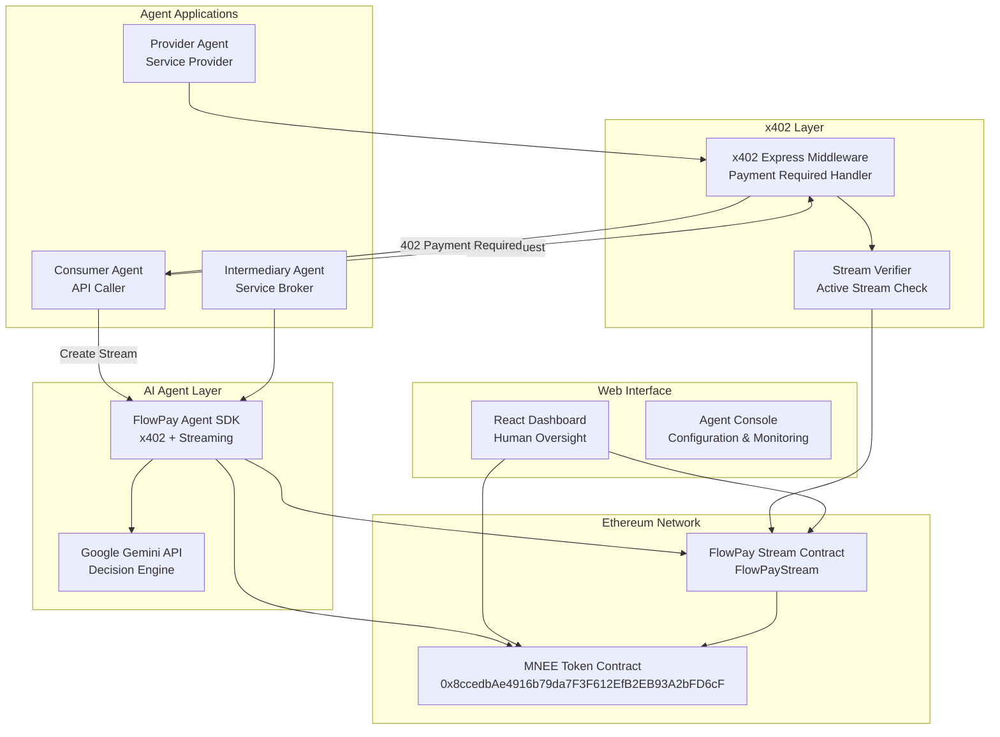
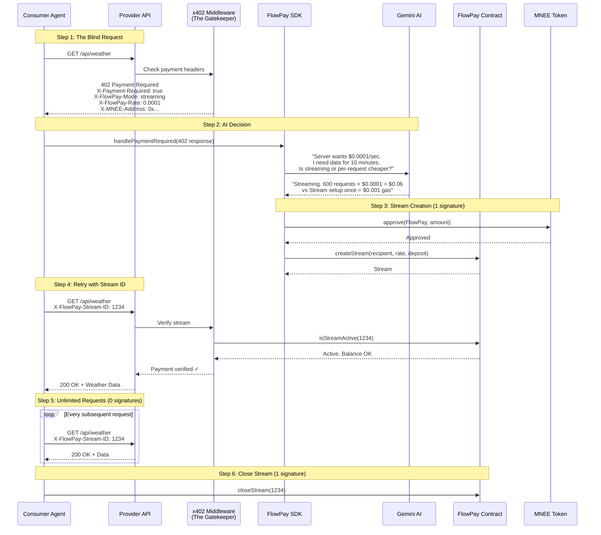

# Design Document

## Overview

FlowPay is a hybrid payment protocol that positions itself as "The Streaming Extension for x402." The system solves the fundamental limitation of standard x402: the N+1 Signature Problem where every HTTP request requires a unique cryptographic signature and settlement event.

**The Core Innovation**: x402 as the "Menu" + Streaming as the "Tab"
- **x402 Discovery (Menu)**: Standard HTTP 402 responses tell agents "Here is what I cost"
- **Payment Streams (Tab)**: Agents open a stream once and make thousands of requests against it
- **Zero Per-Request Overhead**: Only 2 on-chain transactions (Open and Close) regardless of request volume

This hybrid approach provides:
- **Standardized Discovery**: x402-compatible HTTP 402 responses for universal agent interoperability
- **Efficient Streaming**: Continuous per-second payments for high-volume usage (1000s of API calls)
- **Intelligent Decisions**: Gemini AI integration for optimal payment mode selection
- **N+1 Problem Solved**: One signature opens the stream, unlimited requests follow

By leveraging both x402's open standard and MNEE's instant settlement, FlowPay makes micropayments economically viable while maintaining compatibility with the broader agent payment ecosystem.

### Comparison: Pure x402 vs FlowPay Streaming

| Feature | x402 (Standard) | FlowPay Streaming |
|---------|-----------------|-------------------|
| Best For | Single article, One-off API call | GPU rental, Real-time data, High-freq trading |
| Overhead | High (1 Signature per Request) | Low (1 Signature per Session) |
| Latency | Medium (Wait for settlement) | Instant (Optimistic updates) |
| Gas Costs | N transactions for N requests | 2 transactions total |
| UX | "Pay as you go" | "Pay as you flow" |

## Architecture

### System Components



### Hybrid Payment Flow (The x402 Handshake)



### Network Architecture

The system operates on Ethereum Sepolia testnet for development and testing, with the following network configuration:

- **Blockchain**: Ethereum Sepolia Testnet (Chain ID: 11155111)
- **MNEE Token**: Mock ERC-20 contract for testing (production uses mainnet contract)
- **RPC Provider**: Alchemy/Infura Sepolia endpoints
- **Block Explorer**: Sepolia Etherscan integration

### Data Flow

1. **x402 Discovery (The Menu)**: Agent makes blind HTTP request, receives 402 with payment requirements
2. **AI Decision**: SDK passes requirements to Gemini: "Is streaming or per-request cheaper?"
3. **Stream Creation (1 Signature)**: SDK approves MNEE and creates payment stream on-chain
4. **Service Consumption (0 Signatures)**: Agent includes stream ID in requests, middleware verifies
5. **Continuous Payment**: Money flows per-second while agent consumes services
6. **AI Optimization**: Gemini analyzes usage and recommends payment mode switches
7. **Stream Close (1 Signature)**: Agent closes stream when done, settling final balance
8. **Real-time Monitoring**: Web dashboard provides human oversight

**Total On-Chain Transactions**: 2 (Open + Close) regardless of request count

## Components and Interfaces

### x402 Payment Middleware (The Gatekeeper)

Express.js middleware that wraps API endpoints with x402 payment requirements. This is the "Gatekeeper" that:
1. Catches requests without payment headers
2. Returns HTTP 402 with pricing information (the "Menu")
3. Verifies active streams for authenticated requests
4. Tracks usage metrics per stream

```typescript
// x402 Middleware Configuration
interface FlowPayMiddlewareConfig {
    endpoints: {
        [route: string]: {
            price: string;           // MNEE per request or per second
            mode: 'per-request' | 'streaming' | 'both';
            minDeposit?: string;     // Minimum stream deposit for streaming mode
            description: string;
            network: 'ethereum-sepolia' | 'ethereum-mainnet';
        }
    };
    mneeAddress: string;
    flowPayContract: string;
    verifyStream: boolean;
}

// Usage Example - The Gatekeeper in action
app.use(flowPayMiddleware({
    endpoints: {
        "GET /api/weather": {
            price: "0.0001",        // $0.0001 per second
            mode: "streaming",      // Streaming preferred for high-volume
            minDeposit: "1.00",     // Minimum 1 MNEE deposit
            description: "Real-time weather data API",
            network: "ethereum-sepolia"
        },
        "POST /api/translate": {
            price: "0.001",         // $0.001 per request
            mode: "both",           // Accept either mode
            description: "AI translation service",
            network: "ethereum-sepolia"
        }
    },
    mneeAddress: "0x...",
    flowPayContract: "0x...",
    verifyStream: true
}));
```

**x402 PaymentRequired Response Format (The Menu)**:
```typescript
// HTTP 402 Response Headers
interface PaymentRequiredHeaders {
    'X-Payment-Required': 'true';
    'X-FlowPay-Mode': 'streaming' | 'per-request' | 'both';
    'X-FlowPay-Rate': string;      // MNEE per second (streaming) or per request
    'X-FlowPay-Address': string;   // Recipient address for streams
    'X-FlowPay-Min-Deposit': string;
    'X-FlowPay-Contract': string;  // FlowPay contract address
    'X-FlowPay-Network': string;   // ethereum-sepolia or ethereum-mainnet
}

// PaymentRequirements object (x402 compatible, Base64 encoded in header)
interface PaymentRequirements {
    scheme: 'flowpay-stream' | 'exact';
    network: string;
    maxAmountRequired: string;
    resource: string;
    description: string;
    mimeType: string;
    payTo: string;
    maxTimeoutSeconds: number;
    extra: {
        flowPayMode: 'streaming' | 'per-request' | 'both';
        ratePerSecond?: string;
        minDeposit?: string;
        streamContract: string;
    };
}
```

**Stream Verification Flow**:
```typescript
// When request includes X-FlowPay-Stream-ID
async function verifyStream(streamId: string, recipient: string): Promise<boolean> {
    const stream = await flowPayContract.getStream(streamId);
    return (
        stream.isActive &&
        stream.recipient === recipient &&
        stream.getClaimableBalance() > 0
    );
}
```

### FlowPay Smart Contract (FlowPayStream)

The core smart contract is the FlowPayStream implementation:

```solidity
// FlowPayStream contract
contract FlowPayStream {
    IERC20 public mneeToken; // MNEE token interface
    
    struct Stream {
        address sender;
        address recipient;
        uint256 totalAmount;        // MNEE tokens (18 decimals)
        uint256 flowRate;           // MNEE per second
        uint256 startTime;
        uint256 stopTime;
        uint256 amountWithdrawn;
        bool isActive;
        string metadata;            // JSON metadata for agents
    }
    
    // Enhanced functions
    function createStream(
        address recipient,
        uint256 duration,
        uint256 depositAmount,
        string calldata metadata
    ) external;
    
    function createStreamWithApproval(
        address recipient,
        uint256 duration,
        uint256 depositAmount,
        string calldata metadata
    ) external;
}
```

**Key Features of FlowPayStream**:
- Replace `payable` ETH functions with MNEE token transfers
- Add `transferFrom` for MNEE deposits
- Include metadata field for agent identification
- Add batch operations for multiple streams
- Implement emergency pause functionality

### Agent SDK Architecture (The Negotiator)

The SDK handles the x402 handshake automatically - agents don't need to know prices beforehand:

```typescript
// Core SDK Interface with x402 Handshake Support
interface FlowPayAgent {
    // Authentication
    authenticate(apiKey: string): Promise<void>;
    
    // x402 Handshake (automatic)
    handlePaymentRequired(response: Response): Promise<PaymentRequirements>;
    parseX402Response(headers: Headers): PaymentRequirements;
    
    // Stream Management
    createStream(params: StreamParams): Promise<StreamResult>;
    createStreamFromX402(requirements: PaymentRequirements): Promise<StreamResult>;
    cancelStream(streamId: string): Promise<void>;
    withdrawFunds(streamId: string): Promise<void>;
    
    // Hybrid Payment Mode Selection
    makeRequest(url: string, options?: RequestOptions): Promise<Response>;
    selectPaymentMode(requirements: PaymentRequirements): 'streaming' | 'per-request';
    
    // Service Discovery (x402 native)
    discoverServices(category: ServiceCategory): Promise<Service[]>;
    registerService(service: ServiceDefinition): Promise<void>;
    
    // AI Decision Making (Gemini Integration)
    optimizeSpending(context: SpendingContext): Promise<OptimizationResult>;
    analyzeUsage(timeframe: TimeFrame): Promise<UsageAnalysis>;
    recommendPaymentMode(usage: UsagePattern): Promise<PaymentModeRecommendation>;
    
    // Auto-management
    enableAutoRenewal(streamId: string, config: AutoRenewalConfig): Promise<void>;
    setSpendingLimits(limits: SpendingLimits): Promise<void>;
    
    // Efficiency Metrics (N+1 Problem Tracking)
    getEfficiencyMetrics(): EfficiencyMetrics;
}

interface EfficiencyMetrics {
    totalRequests: number;
    totalSignatures: number;      // Should be ~2 per session
    gasSpent: BigNumber;
    requestsPerSignature: number; // Higher = more efficient
}

// x402-aware HTTP Client (The Negotiator in action)
interface FlowPayFetch {
    // Automatically handles 402 responses
    fetch(url: string, options?: RequestInit): Promise<Response>;
    
    // Get active stream for a service
    getActiveStream(serviceUrl: string): StreamInfo | null;
    
    // Configure payment preferences
    setPaymentPreferences(prefs: PaymentPreferences): void;
}

// Gemini Integration for Payment Mode Intelligence
interface GeminiDecisionEngine {
    analyzeSpendingPattern(data: UsageData): Promise<SpendingInsights>;
    recommendOptimizations(context: AgentContext): Promise<Recommendation[]>;
    evaluateServiceQuality(metrics: ServiceMetrics): Promise<QualityScore>;
    negotiatePricing(proposal: PricingProposal): Promise<CounterProposal>;
    
    // x402 specific - The AI Decision
    recommendPaymentMode(
        requirements: PaymentRequirements,
        expectedUsage: UsageEstimate
    ): Promise<PaymentModeDecision>;
}

interface PaymentModeDecision {
    mode: 'streaming' | 'per-request';
    reasoning: string;  // Human-readable explanation for dashboard
    costEstimate: {
        streaming: BigNumber;
        perRequest: BigNumber;
    };
    confidence: number;
}
```

**SDK Usage Example - The Complete x402 Handshake**:
```typescript
import { FlowPayAgent } from 'flowpay-sdk';

const agent = new FlowPayAgent({
    privateKey: process.env.AGENT_PRIVATE_KEY,
    geminiApiKey: process.env.GEMINI_API_KEY,
    network: 'sepolia'
});

// The agent just tries to fetch - SDK handles everything
const response = await agent.makeRequest('https://api.weather-agent.com/forecast');

// Behind the scenes, the SDK:
// 1. Makes blind request → receives 402
// 2. Parses x402 headers (X-FlowPay-Mode, X-FlowPay-Rate, etc.)
// 3. Asks Gemini: "Is streaming or per-request cheaper?"
// 4. Creates MNEE stream if streaming mode selected (1 signature)
// 5. Retries request with X-FlowPay-Stream-ID header
// 6. Returns successful response

console.log(await response.json()); // Weather data

// Check efficiency metrics
const metrics = agent.getEfficiencyMetrics();
console.log(`Made ${metrics.totalRequests} requests with only ${metrics.totalSignatures} signatures`);
// Output: "Made 1000 requests with only 2 signatures"
```

### Web Dashboard Components

The React-based dashboard provides comprehensive monitoring and control:

**Dashboard Layout**:
- **Overview Panel**: Real-time statistics and active streams
- **Stream Management**: Create, monitor, and cancel streams
- **Agent Console**: Configure AI agents and API keys
- **Analytics**: Spending patterns and optimization insights
- **Network Explorer**: Public stream activity and statistics

**Key Features**:
- Real-time balance counters with per-second updates
- Stream metadata display with agent identification
- AI decision logs and reasoning explanations
- Emergency controls for pausing agent activity
- Integration testing tools for agent development

## Data Models

### Stream Data Model

```typescript
interface PaymentStream {
    id: string;
    sender: Address;
    recipient: Address;
    totalAmount: BigNumber;      // MNEE tokens (18 decimals)
    flowRate: BigNumber;         // MNEE per second
    startTime: number;           // Unix timestamp
    stopTime: number;            // Unix timestamp
    amountWithdrawn: BigNumber;  // MNEE already withdrawn
    isActive: boolean;
    metadata: StreamMetadata;
}

interface StreamMetadata {
    agentId: string;
    serviceType: ServiceType;
    purpose: string;
    contractTerms?: string;
    expectedUsage?: UsageEstimate;
    aiDecision?: boolean;
}
```

### Agent Configuration Model

```typescript
interface AgentConfig {
    agentId: string;
    apiKey: string;
    walletAddress: Address;
    spendingLimits: SpendingLimits;
    autoRenewal: AutoRenewalSettings;
    geminiConfig: GeminiSettings;
    services: RegisteredService[];
}

interface SpendingLimits {
    dailyLimit: BigNumber;       // MNEE per day
    perStreamLimit: BigNumber;   // MNEE per stream
    emergencyStop: boolean;
    alertThresholds: AlertConfig;
}
```

### Service Registry Model

```typescript
interface ServiceDefinition {
    serviceId: string;
    providerId: string;
    category: ServiceCategory;
    pricing: PricingModel;
    paymentAddress: Address;
    metadata: ServiceMetadata;
    qualityMetrics: QualityMetrics;
}

enum ServiceCategory {
    API_CALLS = "api_calls",
    GPU_COMPUTE = "gpu_compute", 
    DATA_FEEDS = "data_feeds",
    CONTENT_ACCESS = "content_access",
    STORAGE = "storage"
}
```

## Correctness Properties

*A property is a characteristic or behavior that should hold true across all valid executions of a system—essentially, a formal statement about what the system should do. Properties serve as the bridge between human-readable specifications and machine-verifiable correctness guarantees.*

### Property-Based Testing Overview

Property-based testing validates software correctness by testing universal properties across many generated inputs. Each property is a formal specification that should hold for all valid inputs, ensuring the system behaves correctly under all conditions.

### Core Principles

1. **Universal Quantification**: Every property contains an explicit "for all" statement
2. **Requirements Traceability**: Each property references the requirements it validates  
3. **Executable Specifications**: Properties are implementable as automated tests
4. **Comprehensive Coverage**: Properties cover all testable acceptance criteria

### Correctness Properties

**Property 1: MNEE Token Stream Operations**
*For any* payment stream creation, deposit, or withdrawal operation, the system should use MNEE tokens with 18-decimal precision, require proper approval flows, and never use ETH
**Validates: Requirements 1.1, 1.2, 1.3, 1.5**

**Property 2: Real-time Streaming Calculations**
*For any* active payment stream, the claimable amount should equal (elapsed_seconds × rate_per_second) minus already_withdrawn, calculated without blockchain queries, and begin immediately upon stream creation
**Validates: Requirements 4.1, 4.3, 4.5**

**Property 3: x402 Service Discovery (The Menu)**
*For any* HTTP request to a protected endpoint without payment headers, the system should return HTTP 402 with x402-compatible headers including X-Payment-Required, X-FlowPay-Mode, X-FlowPay-Rate, and X-MNEE-Address
**Validates: Requirements 5.1, 5.2, 11.2**

**Property 4: x402 Response Parsing and Retry**
*For any* x402 PaymentRequired response, the SDK should correctly parse payment requirements, and after stream creation, retry the original request with X-FlowPay-Stream-ID header
**Validates: Requirements 5.3, 5.7**

**Property 5: Stream Verification (The Gatekeeper)**
*For any* request with X-FlowPay-Stream-ID header, the middleware should verify the stream is active on-chain and has sufficient balance before granting access (200 OK) or requesting top-up (402)
**Validates: Requirements 5.8, 11.5, 11.6, 11.8**

**Property 6: Streaming Efficiency (Solving N+1 Signature Problem)**
*For any* streaming session, the system should require exactly one signature to open the stream, zero signatures for subsequent requests (only X-FlowPay-Stream-ID header), and exactly two on-chain transactions total (open + close)
**Validates: Requirements 13.1, 13.2, 13.3, 13.4**

**Property 7: Hybrid Payment Mode Selection**
*For any* expected usage pattern, the SDK should recommend per-request mode for few requests (1-10) and streaming mode for many requests (100+), with AI reasoning logged for human oversight
**Validates: Requirements 12.2, 12.3, 12.7**

**Property 8: Stream Metadata Integrity**
*For any* stream created through the SDK, the system should automatically include agent identification in JSON metadata and support querying/filtering based on this metadata
**Validates: Requirements 8.1, 8.2, 8.3, 8.5**

**Property 9: Automatic Stream Creation from 402**
*For any* agent service interaction requiring payment, the SDK should automatically detect 402 responses, approve MNEE spending, and create appropriate streams without manual intervention
**Validates: Requirements 3.2, 3.6, 5.5**

**Property 10: Safety Mechanism Enforcement**
*For any* agent exceeding spending limits, service unavailability, or suspicious activity detection, the system should automatically trigger protective actions including stream cancellation and operator alerts
**Validates: Requirements 9.1, 9.2, 9.3, 9.5**

**Property 11: Multi-agent Service Chains**
*For any* service chain involving multiple agents, the system should support simultaneous streams between same pairs, margin-based pricing, automatic downstream stream creation, and accurate payment flow tracking
**Validates: Requirements 10.1, 10.2, 10.3, 10.4**

**Property 12: Micropayment Support**
*For any* payment rate as low as 0.0001 MNEE per second, the system should handle stream creation, calculation, and withdrawal operations correctly with full precision
**Validates: Requirements 4.2**

**Property 13: Auto-renewal Functionality**
*For any* stream configured with auto-renewal, the SDK should automatically renew the stream before expiration to prevent service interruptions
**Validates: Requirements 3.5**

**Property 14: API Key Authentication**
*For any* SDK operation requiring authentication, the system should properly validate API keys and reject unauthorized access attempts
**Validates: Requirements 3.4**

**Property 15: Efficiency Metrics Tracking**
*For any* streaming session, the SDK should accurately track and report efficiency metrics including total requests, total signatures (should be ~2), and requests-per-signature ratio
**Validates: Requirements 13.7**

## Error Handling

### Smart Contract Error Handling

**MNEE Token Integration Errors**:
- **Insufficient Allowance**: Revert with clear message when MNEE approval is insufficient
- **Transfer Failures**: Handle failed MNEE transfers gracefully with proper error messages
- **Invalid Token Contract**: Validate MNEE contract address and interface compatibility

**Stream Operation Errors**:
- **Invalid Parameters**: Validate stream parameters (positive amounts, valid addresses, reasonable durations)
- **Unauthorized Access**: Ensure only stream participants can withdraw or cancel
- **Insufficient Balance**: Handle cases where claimable amount exceeds available funds

**Emergency Situations**:
- **Contract Pause**: Implement pausable functionality for emergency stops
- **Upgrade Path**: Design contract upgrade mechanism for critical fixes
- **Recovery Mechanisms**: Provide fund recovery options for edge cases

### Agent SDK Error Handling

**Network Connectivity**:
- **RPC Failures**: Implement retry logic with exponential backoff
- **Network Switching**: Handle network mismatch gracefully with user prompts
- **Transaction Failures**: Provide detailed error messages and retry options

**AI Integration Errors**:
- **Gemini API Failures**: Fallback to rule-based decisions when AI is unavailable
- **Rate Limiting**: Handle API rate limits with queuing and retry mechanisms
- **Invalid Responses**: Validate AI responses and use defaults for malformed data

**Service Discovery Errors**:
- **Service Unavailability**: Detect and handle service downtime automatically
- **Payment Failures**: Retry payment operations with exponential backoff
- **Metadata Corruption**: Validate and sanitize service metadata

### Web Dashboard Error Handling

**User Interface Errors**:
- **Wallet Connection**: Handle MetaMask connection failures and network issues
- **Real-time Updates**: Gracefully handle WebSocket disconnections
- **Data Loading**: Provide loading states and error messages for failed requests

**Agent Management Errors**:
- **Configuration Validation**: Validate agent configurations before saving
- **API Key Management**: Secure handling of API keys with proper encryption
- **Spending Limit Enforcement**: Prevent configuration of invalid spending limits

## Testing Strategy

### Dual Testing Approach

The FlowPay system requires comprehensive testing using both unit tests and property-based tests to ensure correctness across all scenarios:

**Unit Tests**: Focus on specific examples, edge cases, and integration points
- Specific MNEE token approval and transfer scenarios
- Stream creation with various parameter combinations
- Agent SDK method functionality with known inputs
- Web dashboard component behavior with mock data
- Error handling for known failure modes

**Property-Based Tests**: Verify universal properties across all inputs
- Stream calculation accuracy across random rates and durations
- MNEE token operations with generated amounts and addresses
- Agent decision-making with varied spending patterns
- Service discovery with random service configurations
- Multi-agent interactions with complex flow patterns

### Property-Based Testing Configuration

**Testing Framework**: Use `fast-check` for JavaScript/TypeScript property-based testing
**Test Iterations**: Minimum 100 iterations per property test to ensure comprehensive coverage
**Test Tagging**: Each property test must reference its design document property

Example test tag format:
```javascript
// Feature: mnee-ai-agent-payments, Property 1: MNEE Token Stream Operations
```

**Generator Strategy**: Create intelligent generators that:
- Generate valid MNEE amounts within realistic ranges
- Create valid Ethereum addresses for testing
- Generate realistic service metadata and configurations
- Produce varied agent spending patterns and behaviors
- Create complex multi-agent service chain scenarios

### Integration Testing

**End-to-End Scenarios**:
- Complete agent lifecycle from registration to service consumption
- Multi-agent service chains with real payment flows
- Emergency scenarios with automatic safety mechanism triggers
- AI decision-making integration with real Gemini API responses

**Performance Testing**:
- Stream calculation performance with high-frequency updates
- Concurrent agent operations under load
- Real-time dashboard updates with multiple active streams
- Gemini API integration under various response times

**Security Testing**:
- API key validation and secure storage
- Smart contract access control and authorization
- Agent spending limit enforcement under attack scenarios
- Metadata injection and validation security

### Testing Environment Setup

**Testnet Configuration**:
- Ethereum Sepolia testnet deployment
- Mock MNEE token contract for testing
- Test agent configurations with limited spending
- Isolated testing environment for AI integration

**Continuous Integration**:
- Automated test execution on code changes
- Property test failure analysis and reporting
- Integration test monitoring and alerting
- Performance regression detection