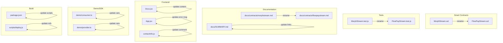

# Design Document: Morph to FlowPay Refactor

## Overview

This design outlines the systematic approach to remove all "Morph" references from the FlowPay project. The refactoring involves renaming files, updating code references, modifying documentation, and ensuring the project remains fully functional after changes.

The key principle is to perform changes in a specific order to minimize breakage:
1. Update source files (contracts, code)
2. Update configuration and build files
3. Update documentation
4. Rebuild and verify

## Architecture

The refactoring touches multiple layers of the project:



## Components and Interfaces

### File Renaming Map

| Current Path | New Path |
|-------------|----------|
| `contracts/MorphStream.sol` | `contracts/FlowPayStream.sol` |
| `test/MorphStream.test.js` | `test/FlowPayStream.test.js` |
| `docs/contracts/morphstream.md` | `docs/contracts/flowpaystream.md` |
| `artifacts/contracts/MorphStream.sol/` | `artifacts/contracts/FlowPayStream.sol/` |

### String Replacement Map

| Pattern | Replacement | Scope |
|---------|-------------|-------|
| `MorphStream` | `FlowPayStream` | All files |
| `morphStream` | `flowPayStream` | Variable names |
| `MORPHSTREAM_ADDRESS` | `FLOWPAYSTREAM_ADDRESS` | Constants |
| `morphstream` | `flowpaystream` | File references, URLs |
| `Morph Holesky` | `Sepolia` | Network references |
| `Morph network` | `Sepolia network` | Documentation |

### Files to Update (Content Only)

1. **Smart Contract**: `contracts/FlowPayStream.sol`
   - Contract name
   - NatSpec comments
   - Error message prefixes

2. **Test File**: `test/FlowPayStream.test.js`
   - Contract references
   - Variable names

3. **Documentation Files**:
   - `docs/README.md`
   - `docs/SUMMARY.md`
   - `docs/contracts/README.md`
   - `docs/contracts/flowpaystream.md`
   - `docs/contracts/mock-mnee.md`
   - `docs/contracts/events-errors.md`
   - `docs/deployment/README.md`
   - `docs/deployment/sepolia.md`
   - `docs/getting-started/README.md`
   - `docs/getting-started/configuration.md`
   - `docs/reference/faq.md`
   - `DEPLOYMENT.md`
   - `README.md`

4. **Frontend Files**:
   - `vite-project/src/pages/Docs.jsx`
   - `vite-project/src/App.jsx`
   - `vite-project/src/contactInfo.js`
   - `vite-project/README.md`

5. **Demo Files**:
   - `demo/consumer.ts`
   - `demo/demo_script.md`

6. **Server Files**:
   - `server/middleware/flowPayMiddleware.js`

7. **Configuration Files**:
   - `package.json`
   - `scripts/deploy.js`

8. **Spec Files**:
   - `.kiro/specs/mnee-ai-agent-payments/design.md`
   - `.kiro/specs/mnee-ai-agent-payments/tasks.md`

## Data Models

No data model changes required. The smart contract's data structures remain identical - only the contract name and error message prefixes change.


## Correctness Properties

*A property is a characteristic or behavior that should hold true across all valid executions of a system—essentially, a formal statement about what the system should do. Properties serve as the bridge between human-readable specifications and machine-verifiable correctness guarantees.*

Based on the prework analysis, most acceptance criteria are specific examples (file renames, specific string replacements). However, we can define one comprehensive property that validates the entire refactoring:

### Property 1: No Morph References Remain

*For any* file in the project (excluding `node_modules`, `.git`, and build artifacts), after refactoring is complete, the file SHALL NOT contain any of the following patterns:
- `MorphStream` (as a contract/class name)
- `morphStream` (as a variable name)
- `MORPHSTREAM` (as a constant)
- `morphstream` (as a file reference)
- `Morph Holesky` (as a network name)
- `Morph network` (as a network reference)

**Exception**: The word "glassmorphism" in CSS is a design term unrelated to Morph network and should be preserved.

**Validates: Requirements 3.3, 3.4, 3.5, 8.3**

### Property 2: Contract Compilation Success

*For any* valid Solidity source file in `contracts/`, after renaming, the Hardhat compiler SHALL produce valid artifacts without errors.

**Validates: Requirements 1.2, 5.1, 8.2**

### Property 3: Test Suite Passes

*For any* test file in `test/`, after updating references, all tests SHALL pass when executed.

**Validates: Requirements 2.2, 8.1**

## Error Handling

### Potential Issues and Mitigations

| Issue | Mitigation |
|-------|------------|
| Broken imports after file rename | Update all import statements before renaming |
| Cached artifacts with old names | Run `npx hardhat clean` before recompiling |
| Frontend build cache | Clear `vite-project/dist` and rebuild |
| Git history confusion | Use `git mv` for file renames to preserve history |

### Rollback Strategy

If issues arise:
1. Git revert to previous commit
2. Re-run the refactoring with fixes
3. Verify with test suite

## Testing Strategy

### Verification Approach

This refactoring is primarily verified through:

1. **Compilation Check**: Run `npx hardhat compile` to ensure contracts compile
2. **Test Execution**: Run `npm test` to ensure all tests pass
3. **Grep Verification**: Search for remaining "Morph" references (excluding glassmorphism)
4. **Manual Review**: Spot-check key files for correct replacements

### Verification Commands

```bash
# 1. Clean and compile contracts
npx hardhat clean
npx hardhat compile

# 2. Run all tests
npm test

# 3. Search for remaining Morph references (should return only glassmorphism)
grep -r "Morph" --include="*.sol" --include="*.js" --include="*.ts" --include="*.jsx" --include="*.md" . | grep -v "node_modules" | grep -v "glassmorphism" | grep -v ".git"

# 4. Verify new files exist
ls contracts/FlowPayStream.sol
ls test/FlowPayStream.test.js
ls docs/contracts/flowpaystream.md
```

### Unit Tests vs Property Tests

For this refactoring:
- **Unit tests**: The existing contract tests serve as unit tests - they verify the contract functionality works correctly after renaming
- **Property test**: A grep-based verification that no Morph references remain serves as the property test

The existing test suite (`test/FlowPayStream.test.js` after rename) validates that the contract behavior is unchanged. The grep verification validates that all references have been updated.

## Implementation Order

To minimize breakage, changes should be made in this order:

1. **Phase 1: Contract Layer**
   - Rename and update `MorphStream.sol` → `FlowPayStream.sol`
   - Clean and recompile to generate new artifacts

2. **Phase 2: Test Layer**
   - Rename and update `MorphStream.test.js` → `FlowPayStream.test.js`
   - Update `package.json` test script
   - Run tests to verify

3. **Phase 3: Documentation Layer**
   - Rename `morphstream.md` → `flowpaystream.md`
   - Update all markdown files
   - Update `SUMMARY.md` navigation

4. **Phase 4: Application Layer**
   - Update frontend files (Docs.jsx, App.jsx, contactInfo.js)
   - Update demo files
   - Update middleware comments

5. **Phase 5: Configuration Layer**
   - Update deploy script
   - Update spec files
   - Rebuild frontend

6. **Phase 6: Verification**
   - Run full test suite
   - Run grep verification
   - Manual spot-check
